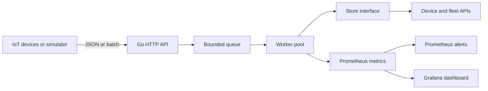

# Go IoT Observability Platform

[](https://github.com/akash-anumolu/go-iot-observability-platform/actions/workflows/ci.yml)
[](https://github.com/akash-anumolu/go-iot-observability-platform/actions/workflows/container.yml)
[](https://go.dev/)

A production-style reference platform for receiving battery telemetry, processing it through a bounded Go worker pool, serving fleet APIs, and exposing real-time Prometheus metrics. The included simulator continuously generates realistic device data so the complete Prometheus and Grafana stack works immediately.

The project focuses on backend concerns that matter in IoT systems: validation, idempotency, backpressure, concurrency safety, bounded memory, graceful shutdown, health probes, observability, container delivery, and automated testing.

## Architecture



## What is included

| Area | Implementation |
| --- | --- |
| Ingestion | Single and batch endpoints, strict JSON decoding, validation, 500-event batch limit |
| Concurrency | Configurable goroutine worker pool, bounded channel, request deadlines, graceful shutdown |
| Reliability | Event idempotency, newest-event device state, bounded per-device history, panic recovery |
| APIs | Device list, current state, newest-first history, fleet health summary, health and readiness probes |
| Metrics | Ingestion outcomes, queue saturation, processing time, SOC, voltage, temperature, and last-seen time |
| Alerts | Offline device, critical SOC, high temperature, queue backlog, and sustained rejection rate |
| Operations | Multi-stage Docker image, Docker Compose, Kubernetes manifest, structured JSON logs |
| Delivery | Go formatting, vet, race-enabled tests, build validation, container CI, and GHCR publishing |
| Documentation | OpenAPI 3.1 specification, configuration reference, example requests, architecture notes |

## Quick start

Requirements: Docker with the Compose plugin.

```bash
git clone https://github.com/akash-anumolu/go-iot-observability-platform.git
cd go-iot-observability-platform
docker compose up --build
```

The stack starts four services:

- API: <http://localhost:8080>
- Prometheus: <http://localhost:9090>
- Grafana: <http://localhost:3000> (`admin` / `admin`)
- Simulator: 25 virtual batteries sending a batch every two seconds

The `Go IoT Fleet Observability` dashboard is provisioned automatically in Grafana.

## Send telemetry

```bash
curl -X POST http://localhost:8080/api/v1/telemetry \
  -H 'Content-Type: application/json' \
  -d '{
    "event_id": "evt-BAT-1001-001",
    "device_id": "BAT-1001",
    "timestamp": "2026-07-15T10:00:00Z",
    "soc": 73.4,
    "voltage": 52.2,
    "current": -8.1,
    "temperature": 33.5,
    "cycle_count": 120,
    "status": "discharging"
  }'
```

The API returns `202 Accepted` after the observation enters the bounded queue. Workers persist it asynchronously. Reusing the same `event_id` is safe: the store records the duplicate metric and does not add the observation again.

## API endpoints

| Method | Path | Purpose |
| --- | --- | --- |
| `POST` | `/api/v1/telemetry` | Queue one telemetry event |
| `POST` | `/api/v1/telemetry/batch` | Queue 1–500 events |
| `GET` | `/api/v1/devices` | List the latest state of all devices |
| `GET` | `/api/v1/devices/{deviceID}` | Get the latest state of one device |
| `GET` | `/api/v1/devices/{deviceID}/history?limit=100` | Get newest-first device history |
| `GET` | `/api/v1/fleet/summary` | Get online, offline, SOC, and temperature aggregates |
| `GET` | `/metrics` | Prometheus text exposition |
| `GET` | `/healthz` | Kubernetes liveness probe |
| `GET` | `/readyz` | Kubernetes readiness probe |

The complete contract is in [`api/openapi.yml`](api/openapi.yml).

## Observability

Prometheus scrapes the API every ten seconds. Important metrics include:

```text
iot_telemetry_ingested_total{result="accepted"}
iot_ingestion_queue_depth
iot_ingestion_queue_capacity
iot_telemetry_processing_duration_seconds_sum
iot_device_soc_percent{device_id="BAT-0001"}
iot_device_temperature_celsius{device_id="BAT-0001"}
iot_device_last_seen_timestamp_seconds{device_id="BAT-0001"}
```

Five alert rules are loaded from [`deploy/prometheus/alerts.yml`](deploy/prometheus/alerts.yml):

- device has not reported for five minutes;
- state of charge remains below 10%;
- temperature remains above 55 °C;
- ingestion queue remains above 80% capacity;
- rejected telemetry exceeds one event per second.

## Configuration

| Variable | Default | Description |
| --- | --- | --- |
| `HTTP_ADDRESS` | `:8080` | API listen address |
| `WORKERS` | `8` | Number of ingestion workers |
| `QUEUE_CAPACITY` | `4096` | Maximum queued events |
| `HISTORY_LIMIT` | `1000` | Retained events per device |
| `OFFLINE_AFTER` | `5m` | Fleet-summary offline threshold |
| `SHUTDOWN_TIMEOUT` | `10s` | Graceful shutdown deadline |
| `DEVICE_COUNT` | `25` | Simulator device count |
| `SIMULATION_INTERVAL` | `2s` | Delay between simulator batches |

See [`.env.example`](.env.example) for a complete local template.

## Local development

Go 1.25 or newer is recommended.

```bash
make run       # start the API
make simulate  # start the simulator in another terminal
make check     # formatting, vet, race-enabled tests, and build
```

Run an individual package test:

```bash
go test -race ./internal/store
```

## Kubernetes

The manifest includes a namespace, configuration, hardened container security context, resource limits, probes, deployment, and service:

```bash
kubectl apply -f deploy/kubernetes/app.yml
```

The reference store is process-local and the manifest intentionally uses one replica. Before horizontal scaling, add a shared implementation of the `store.Store` interface using PostgreSQL, MongoDB, or Redis and then enable an HPA.

## Design decisions

- **Standard library HTTP server:** keeps the runtime image and dependency surface small while using Go 1.22+ method-aware routes.
- **Bounded queue:** prevents traffic spikes from turning into unbounded memory growth.
- **Asynchronous writes:** keeps ingestion latency independent from storage work.
- **Store interface:** separates API and concurrency code from the persistence choice.
- **Generated event IDs:** clients may provide their own idempotency key; otherwise the API derives one from device ID and timestamp.
- **Native Prometheus exposition:** demonstrates the metric format without a runtime library dependency.
- **Per-device metrics:** useful for a controlled fleet; very large fleets should aggregate or shard labels to control time-series cardinality.

## Repository layout

```text
cmd/api/                  API entry point
cmd/simulator/            Virtual battery fleet
internal/api/             HTTP handlers and middleware
internal/config/          Environment configuration
internal/domain/          Telemetry model and validation
internal/ingest/          Concurrent worker pool
internal/metrics/         Prometheus exposition
internal/store/           Store contract and memory implementation
api/openapi.yml           OpenAPI 3.1 contract
deploy/prometheus/        Scraping and alert rules
deploy/grafana/           Provisioned data source and dashboard
deploy/kubernetes/        Kubernetes resources
```

## Roadmap

- PostgreSQL/TimescaleDB persistence adapter and migrations
- MQTT consumer for AWS IoT Core-compatible brokers
- JWT or mTLS device authentication
- Distributed idempotency and horizontal ingestion scaling
- OpenTelemetry traces and exemplars
- Load-test report with sustained throughput and latency percentiles

## License

Licensed under the [MIT License](LICENSE).

